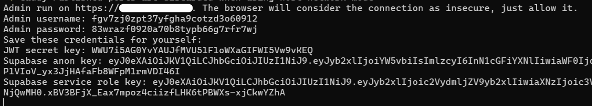
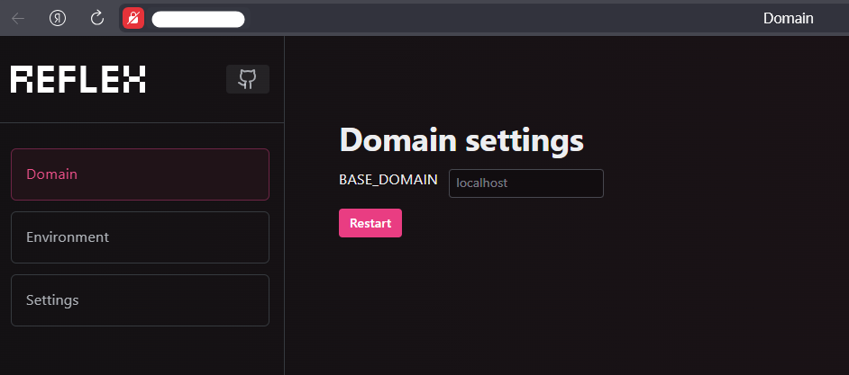
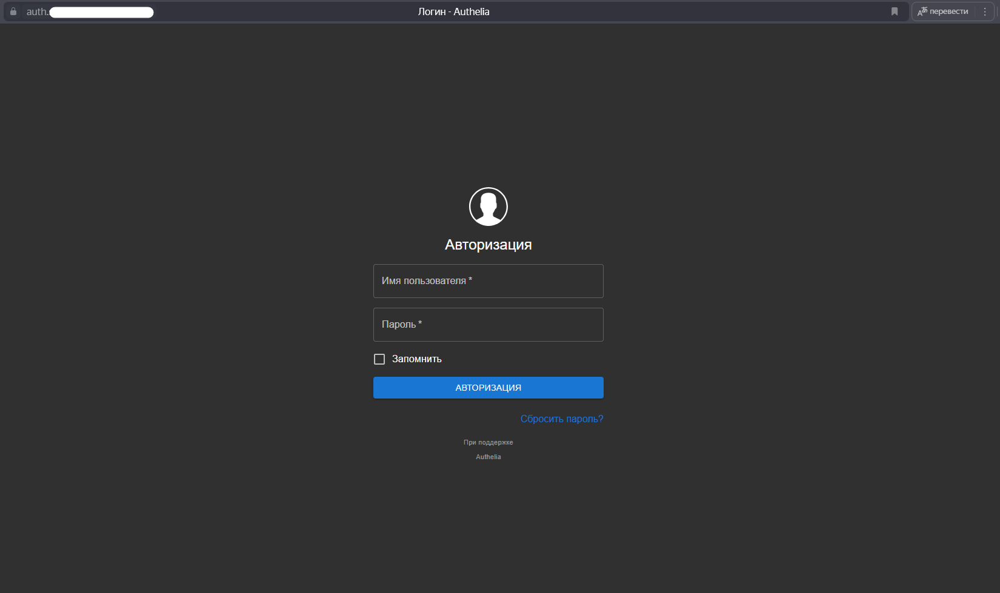
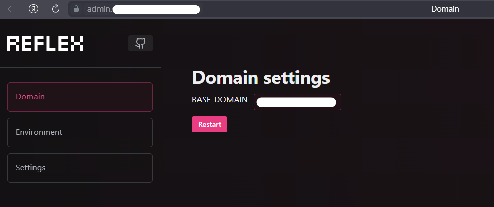
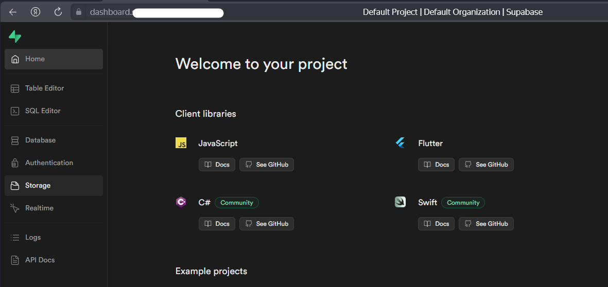
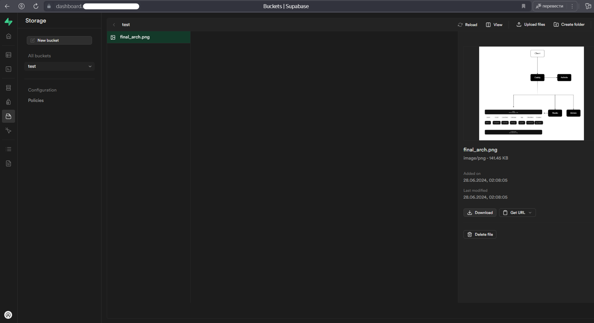

# Supabase-SelfHosted

## Description

Supabase is an open source Firebase alternative. This project provides upgraded version of the [Self-Hosted Supabase](https://supabase.com/docs/guides/self-hosting/docker), with automatic deploy by script, web-client for working with settings, configured ssl and auth system for admin pages securing.

## Install & Run

### Dependencies
* Docker
* Python 3
* Configured public IP and DNS on your host machine

### Setup

```shell
git clone --depth 1 https://github.com/NoCloud-today/Supabase-SelfHosted
cd Supabase-SelfHosted/docker
pip install -r requirements.txt
```

### Run 

```shell
# generate secrets & run admin services on public IP
# Supabase-SelfHosted/docker
python3 start.py
```
Output: 
  
Follow the link, allow insecure connection and pass given credentials to the basic auth form.  
  
Pass domain name for your host machine and click restart. Within 5 minutes, Supabase services will be available at the following addresses:
* ```Supabase Studio``` - ```https://dashboard.<your-domain>```
* ```Admin Service``` - ```https://admin.<your-domain>```
* ```Supabase external API``` - ```https://supabase.<your-domain>```
* ```Authelia``` - ```https://auth.<your-domain>```

Note that ```Studio``` and ```Admin``` are secured by ```Authelia``` (with 'authelia' and 'authelia' user-password for now)




